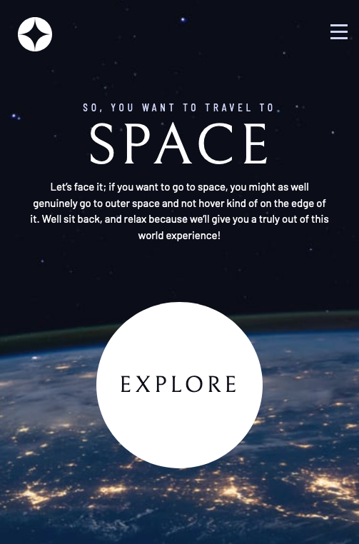
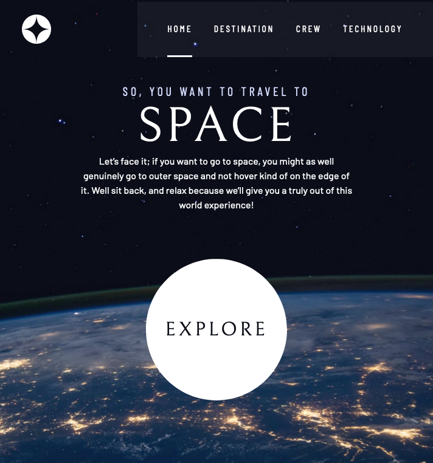
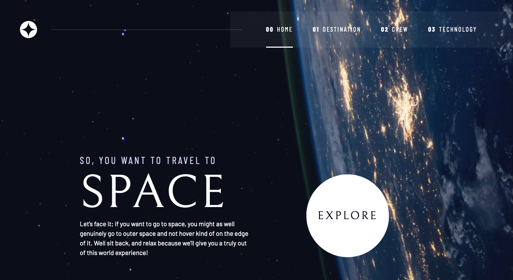

# Frontend Mentor - Space tourism website solution

This is a solution to the [Space tourism website challenge on Frontend Mentor](https://www.frontendmentor.io/challenges/space-tourism-multipage-website-gRWj1URZ3). Frontend Mentor challenges help you improve your coding skills by building realistic projects.

## Table of contents

- [Overview](#overview)
  - [The challenge](#the-challenge)
  - [Screenshot](#screenshot)
  - [Links](#links)
- [My process](#my-process)
  - [Built with](#built-with)
  - [What I learned](#what-i-learned)
  - [Continued development](#continued-development)
- [Author](#author)

## Overview

### The challenge

In this challenge, which is a collaboration between Frontend Mentor, Scrimba, and Kevin Powell it is all about building a multiple page space tourism website and making it look as close as possible to the design. Kevin Powell shows his approach while giving smaller or bigger coding challenges. For more: [Scrimba's free course](https://scrimba.com/learn/spacetravel).

### Screenshot

### Links

- Solution URL: https://github.com/DvoraG/space-website
- Live Site URL: https://dvorag.github.io/space-website/

## My process

In the beginning I chose to code along with Kevin and take every small challenge, he was providing. For me it was more the question, what are the steps to start with such a project, than how to code. It helped me a lot to become more and more confident to solve bigger steps.
In the end I actually decided to take a different approach regarding the data: to fetch it from the included data.json file using JS.

### Built with

- Semantic HTML5 markup
- CSS custom properties
- Flexbox
- CSS Grid
- Mobile-first workflow
- Vanilla JavaScript

### What I learned

For me the most important take aways are the principles, how to start with such a project:

- HTML - always building out the most complex structure first, which is most of the time for  
   desktop
- CSS - mobile first
- design - as close as possible, but no need for 100%

### Continued development

In a next step I want to take this project and dive deeper into grid and flexbox, and maybe using react framework.

## Author

- Frontend Mentor - [@DvoraG](https://www.frontendmentor.io/profile/DvoraG)
